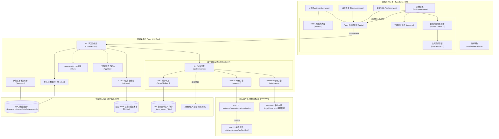
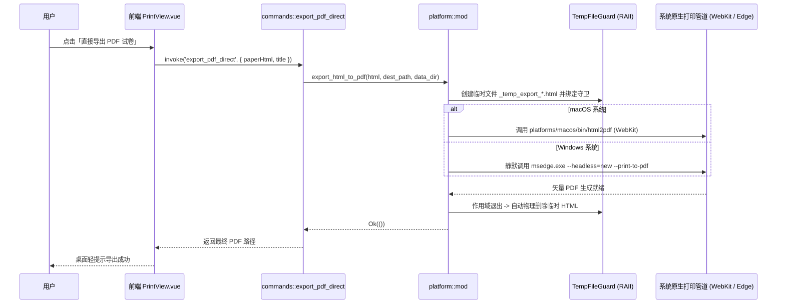

# NaosuNote 架构设计与开发者技术手册 (Architecture & Developer Guide)

> 版本：v0.1.0 beta  
> 技术栈：Tauri v2 + Vue 3 + TypeScript + Rust + SQLite + KaTeX + Material Design 3  
> 适用对象：初次接触或维护 NaosuNote 的核心研发人员

---

## 目录

1. [项目定位与核心设计哲学](#一-项目定位与核心设计哲学)
2. [系统整体架构与拓扑图](#二-系统整体架构与拓扑图)
3. [工程代码目录导航](#三-工程代码目录导航)
4. [核心业务与技术实现细节](#四-核心业务与技术实现细节)
   - [4.1 标准错题数据结构与 Gemini 录入管道](#41-标准错题数据结构与-gemini-录入管道)
   - [4.2 双轨持久化与自动安全迁移引擎 (Storage & Mirroring Engine)](#42-双轨持久化与自动安全迁移引擎-storage--mirroring-engine)
   - [4.3 智能一页吸附与试卷排版引擎 (Auto-Fit Engine)](#43-智能一页吸附与试卷排版引擎-auto-fit-engine)
   - [4.4 跨平台高保真矢量 PDF 导出与静默打印架构](#44-跨平台高保真矢量-pdf-导出与静默打印架构)
   - [4.5 Material Design 3 全局色彩系统与深色模式](#45-material-design-3-全局色彩系统与深色模式)
5. [常见技术陷阱与避坑指南 (Crucial Caveats)](#五-常见技术陷阱与避坑指南-crucial-caveats)
6. [开发调试与跨平台打包构建指令](#六-开发调试与跨平台打包构建指令)

---

## 一、 项目定位与核心设计哲学

NaosuNote 是一款专为 **STEM（数理化生等理科学科）** 设计的专业级错题管理与智能排版重练桌面应用。

### 核心设计原则

1. **本地优先与去中心化 (Local-First & Zero Vendor Lock-in)**：
   - 数据完全保存在用户本地，不依赖任何私有云端服务。
   - 采用 **双轨持久化与跨版本平滑继承架构**：核心关系型数据统一落盘至操作系统个人文档目录 (`~/Documents/NaosuNoteData/naosu.db`)；同时自动为每个错题本生成独立的单文件纯 HTML 镜像。无论免安装绿色版如何替换升级，用户题库始终永恒安全、开箱即用。
2. **严谨的学术版式规范**：
   - 全面剔除 Emoji 表情与非正式日文假名，保持学术试卷与界面的专业度。
   - 数学、物理、化学公式由 KaTeX 本地离线高保真排版。
   - 理科电路图、遗传图谱、化学反应流程图采用内嵌 SVG 矢量图渲染，缩放无损。
3. **试卷印刷智能吸附**：
   - 针对综合大题（含有三线表格、复杂配图、长选项）容易跨页截断的痛点，创新提出**图文左右并排（Side-by-Side）**、**选项自适应分列**与**智能一页吸附（Auto-Fit）**机制，最大化利用 A4/B5 页面空间。
4. **系统级原生无损打印与平台深度解耦**：
   - 不采用简陋的外部网页截屏打印；macOS 接入原生 WebKit/PDFKit 渲染器，Windows 深度集成 Edge Chromium 无头静默打印管道，实现无限放大不失真的矢量输出。
5. **Google Material Design 3 极致视觉体验**：
   - 基于 M3 官方色彩 Token，全链路支持**浅色模式 / 深色模式 / 跟随系统**。

---

## 二、 系统整体架构与拓扑图



---

## 三、 工程代码目录导航

```text
NaosuNote/
├── .gitignore                          # 全项目根目录版本控制防御规则
├── README.md                           # 基础说明文档
├── index.html                          # 网页挂载入口，内嵌离线 KaTeX 字体
├── package.json                        # 前端依赖配置 (Vue, KaTeX, Lucide 等)
├── tsconfig.json / tsconfig.node.json  # TypeScript 编译配置
├── vite.config.ts                      # Vite 8 构建与本地服务器配置
├── public/                             # 静态资源目录
│   ├── favicon.svg                     # 品牌矢量 Logo
│   └── vendor/                         # 本地离线 KaTeX 运行库与 woff2/ttf 字体资产
│
├── platforms/                          # 【跨平台资源归拢中心】
│   ├── macos/                          # macOS 专属资产一站式归拢
│   │   ├── native/                     # WebKit/PDFKit 原生工具 Objective-C 源码
│   │   │   └── html2pdf.m
│   │   ├── bin/                        # 编译输出的原生工具 (build.rs 自动生成，git ignore)
│   │   │   └── html2pdf
│   │   └── scripts/                    # macOS 打包发布脚本
│   │       └── package-app.sh
│   └── windows/                        # Windows 专属资产
│       └── scripts/                    # Windows 绿色免安装 Zip 自动化打包脚本
│           └── package-portable.ps1
│
├── src/                                # 前端 Vue3 源码
│   ├── main.ts                         # 应用挂载入口，全局主题初始化
│   ├── App.vue                         # 根组件：路由切换、全局 Toast、打印篮状态
│   ├── types/                          # 核心数据模型接口 (Problem, Notebook 等)
│   ├── assets/styles/                  # 样式系统 (M3 Tokens、三线表排版、基础重置)
│   ├── components/                     # 通用组件 (NavigationRail, ProblemCard, StarRating 等)
│   ├── views/                          # 核心视图 (IngestView, LibraryView, PrintView, SettingsView)
│   └── utils/                          # 工具库 (api, parser, examFormatter, katexRender, theme)
│
└── src-tauri/                          # 纯净的 Rust 桌面后端宿主
    ├── Cargo.toml                      # Rust 依赖声明 (rusqlite, tauri, serde, rfd 等)
    ├── tauri.conf.json                 # Tauri 配置（窗口尺寸、唯一 ID com.naosunote.app 等）
    ├── build.rs                        # 构建驱动（检测并编译 platforms/macos/native/html2pdf.m）
    └── src/
        ├── main.rs                     # 应用程序入口（Windows 控制台防黑框注入）
        ├── lib.rs                      # Tauri 装配中心（插件与 AppState 注册）
        ├── commands.rs                 # Tauri IPC 业务命令分发层（纯业务，无平台宏）
        ├── storage.rs                  # 数据目录解析、环境变量兜底与初始库无缝平滑迁移
        ├── models.rs                   # 数据结构体定义
        ├── db.rs                       # SQLite 底层连接与持久化操作
        ├── mirror.rs                   # 离线单文件静态 HTML 镜像生成引擎
        ├── utils.rs                    # Levenshtein 字符串查重算法
        └── platform/                   # 跨平台系统级适配核心模块
            ├── mod.rs                  # 统一跨平台对外门面 (open_path / export_html_to_pdf)
            ├── common.rs               # 通用设施：RAII TempFileGuard 临时文件自清理守卫
            ├── macos.rs                # macOS 专属适配：WebKit 渲染工具探测与调度
            └── windows.rs              # Windows 专属适配：Edge/Chrome 级联探测与静默打印
```

---

## 四、 核心业务与技术实现细节

### 4.1 标准错题数据结构与 Gemini 录入管道

错题以标准的语义化 HTML 代码块作为媒介传输，具有极强的可读性与跨媒介兼容性：

```html
<div class="naosu-problem" subject="物理" type="简答" date="20260917" summary="电磁感应双棒模型运动分析" uuid="optional-uuid">
  <div class="problem-body">
    <!-- 纯题干正文，支持 LaTeX 公式如 $E=BLv$ 以及内嵌 SVG/Table -->
    如图所示，在磁感应强度为 $B$ 的匀强磁场中...
    <div class="img">
      <svg viewBox="0 0 400 200">...</svg>
    </div>
    <table>...</table>
    <div class="options">
      <span>A. 速度增大</span>
      <span>B. 速度减小</span>
    </div>
  </div>
</div>
```

**解析与录入管道**：

1. `parser.ts` 提取 `extractCleanStemText`，过滤 `<svg>` 并剥离 HTML 标签，归一化纯文本；
2. 后端 `check_duplicate` 调用 `utils.rs` 计算 Levenshtein 相似度：
   $$Similarity = 1.0 - \frac{Distance}{\max(len1, len2)}$$
3. 相似度 $\ge 85\%$ 时前端弹出 `DuplicateDialog`，提供「提升重要性」与「另存新题」供决策。

---

### 4.2 双轨持久化与自动安全迁移引擎 (Storage & Mirroring Engine)

为保障用户数据的绝对安全以及绿色免安装版快速分发，系统采用 **独立存储管理 + 双写持久化**：

1. **统一存储目录解析与环境变量兜底 (`src-tauri/src/storage.rs`)**：
   - 默认将数据目录固定在系统标准个人文档目录：`~/Documents/NaosuNoteData`（Windows 下解析为 `C:\Users\<用户名>\Documents\NaosuNoteData`）；
   - Windows 环境下提供针对 `%USERPROFILE%\Documents\NaosuNoteData` 的环境变量兜底，抵御权限受限或快捷方式调起的路径偏移；
   - **初始题库无缝迁移机制**：若目标文档目录中尚无 `naosu.db`，系统首次启动时自动从工程自带的 `data/naosu.db` 安全复制一份，保证历史题目免安装开箱即用，后续升级替换 exe 永不丢数据。
2. **SQLite 结构化存储 (`src-tauri/src/db.rs`)**：
   - 毫秒级支持按学科、类型、日期、多选标签搜索与排序，保障日常高频交互性能。
3. **静态 HTML 镜像同步 (`src-tauri/src/mirror.rs`)**：
   - 错题发生增删改或重命名错题本时，`MirrorManager` 自动更新 `{错题本名称}.html`；
   - 文件名经过 `sanitize_filename` 清洗过滤非法字符，内置响应式三线表 CSS、KaTeX 离线字体与自适应打印断页规则，脱离主软件仍可永久浏览。

---

### 4.3 智能一页吸附与试卷排版引擎 (Auto-Fit Engine)

试卷排版核心痛点是：**综合大题配有复杂表格或电路/装置图，垂直堆叠导致单题高度超标，在 A4 纸张物理边界处断裂。**

`src/utils/examFormatter.ts` 实现了三层重构算法：

1. **图文左右并排 (Side-by-Side Typesetting)**：
   - 相邻的 `<table>` 与 `<div class="img">` 自动重构为 `<div class="exam-side-by-side exam-side-table-img">`；
   - 相邻的 `<div class="options">` 与 `<div class="img">` 自动重构为 `<div class="exam-side-by-side exam-side-options-img">`；
   - 左右按 `58% : 38%` 对称并排，垂直占用高度直接缩减 **50%**。
2. **选项长度自适应多列网格**：
   - 选项文字短（$\le 12$ 字符）：分配 `.options-4-col`（四列紧凑横排）；
   - 选项文字中等（$\le 26$ 字符）：分配 `.options-2-col`（两列对称排列）；
   - 选项文字较长（$> 26$ 字符）：分配 `.options-1-col`（纵向独占排列）。
3. **一页吸附微调 (Auto-Fit Single Page)**：
   - 开启一页吸附时，动态压缩行高（`1.32`）、段落间距（`2px`）、表格单元格 Padding（`3px 6px`）以及 SVG 图像限高（`135px`），确保整道综合题完美收敛于 A4 物理单页边界内。

---

### 4.4 跨平台高保真矢量 PDF 导出与静默打印架构

NaosuNote 彻底杜绝了使用 Canvas 栅格化截屏生成模糊 PDF 的劣质方案，在双平台均实现了**真矢量排版导出**：



#### 关键技术亮点

1. **RAII 临时文件守卫 (`src-tauri/src/platform/common.rs`)**：
   - 使用 Rust `Drop` 特征实现 `TempFileGuard`。无论导出成功、返回错误抑或遭遇进程 panic，临时生成的 HTML 文件离开作用域必定被物理删除，绝不污染用户磁盘。
2. **macOS 原生 WebKit/PDFKit 管道 (`src-tauri/src/platform/macos.rs`)**：
   - 源码收纳于 `platforms/macos/native/html2pdf.m`，由 `build.rs` 编译至 `platforms/macos/bin/html2pdf`；
   - 采用隐藏 `WKWebView` 加载，等待 600ms 公式字体渲染稳定后，通过 `WKPDFConfiguration` 切片并合并为多页高保真矢量 PDF。
3. **Windows 系统级 Edge/Chromium 静默管道 (`src-tauri/src/platform/windows.rs`)**：
   - 级联检索 Edge 默认路径（x86/x64）、`%LOCALAPPDATA%` 与 Chrome 备用路径；
   - 核心参数调优：
     - `--headless=new`：启用现代 Chromium 渲染管道；
     - `--run-all-compositor-stages-before-draw`：强制等待 KaTeX 公式与 SVG 排版收敛完成，防止公式掉字；
     - `--no-pdf-header-footer`：彻底清除浏览器打印自带的页眉页脚与 URL 杂质；
     - `CREATE_NO_WINDOW (0x08000000)`：注入 Windows 原生进程标志，彻底杜绝后台调用时黑色 CMD 窗口闪烁。

---

### 4.5 Material Design 3 全局色彩系统与深色模式

- 色彩 Token 基于 Google M3 官方规范在 `src/assets/styles/m3-tokens.css` 中建立，全局响应 `[data-theme="dark"]`。
- **理科图谱深色适配**：错题卡片中的 SVG 矢量图在深色模式下应用 `filter: invert(0.88) hue-rotate(180deg)`，自动反色黑白线条，保持极佳可读性。
- **试卷物理纸张绝对豁免**：在 `src/views/PrintView.vue` 中，物理纸张画布强制固定纯白底色 (`#ffffff !important`) 与纯黑文本 (`#000000 !important`)，确保导出与打印结果始终符合正式考试标准。

---

## 五、 常见技术陷阱与避坑指南 (Crucial Caveats)

### 1. macOS WKWebView 拦截 `window.confirm` 与 `window.alert`

- **现象**：在 macOS WKWebView 下，原生 `window.confirm()` 不会弹出任何系统提示框，直接返回 `false`，导致删除等危险操作静默失效。
- **强制规则**：**全项目严禁使用原生 `window.confirm` 或 `window.alert`**。所有危险交互必须采用 Vue 响应式驱动的 M3 模态对话框。

### 2. Windows 命令行调用必须消除 CMD 黑色控制台闪烁

- **现象**：在 Windows 下直接使用 `Command::new("cmd")` 唤起浏览器或执行外部程序，屏幕会突兀闪烁一个黑色命令行窗口。
- **强制规则**：Windows 分支下的所有 `std::process::Command` 必须通过 `std::os::windows::process::CommandExt` 附加 `.creation_flags(0x08000000)` (`CREATE_NO_WINDOW`)。

### 3. 跨平台业务层禁止直接书写平台宏

- **现象**：在 `commands.rs` 或业务中交织大量 `#[cfg(target_os = "...")]` 会导致代码急速腐化。
- **强制规则**：所有涉及平台特性的逻辑必须下沉到 `src-tauri/src/platform/` 模块内部，上层仅面向 `platform::mod` 的抽象门面编程。

### 4. Rust `format!` 宏中的内联 CSS 花括号转义

- **现象**：在 Rust 原始字符串中直接书写 `:root { ... }` 会被编译器当作格式化占位符引发崩溃。
- **强制规则**：内联 CSS 字符串中的普通大括号必须双写转义为 `{{` 与 `}}`。

### 5. 多平台文件系统路径清洗

- **现象**：错题本标题包含斜杠 `/`、反斜杠 `\` 或冒号 `:` 时，直接拼接文件名会导致文件写入失败甚至路径穿越。
- **强制规则**：与本地文件系统交互的文件名必须经过 `MirrorManager::sanitize_filename()` 进行字符净化。

---

## 六、 开发调试与跨平台打包构建指令

### 1. 环境准备

- Node.js 18+ 与 pnpm 9+
- Rust 1.77+ 与 Cargo
- macOS：系统自带 `clang`
- Windows：Visual Studio C++ Build Tools (MSVC) 与 Windows 10/11 预装 Microsoft Edge

### 2. 本地日常开发

```bash
# 安装前端依赖
pnpm install

# 纯前端开发预览 (运行于 localhost:5173，内置 Mock 数据降级)
pnpm run dev

# 启动完整 Tauri 桌面客户端 (支持前后端热重载)
pnpm run tauri dev
```

### 3. 质量保障与验证

```bash
# 前端 TypeScript 类型检查与生产打包验证
pnpm run build

# 后端 Rust 代码语法与跨平台模块检查
cargo check --manifest-path src-tauri/Cargo.toml

# 运行后端单元测试 (如文本查重算法)
cargo test --manifest-path src-tauri/Cargo.toml
```

### 4. 跨平台分发打包

#### macOS 原生应用包打包

```bash
# 使用 macOS 专用打包脚本一键打包
./platforms/macos/scripts/package-app.sh
# 产物输出于：src-tauri/target/release/bundle/macos/NaosuNote.app (或 dmg)
```

#### Windows 绿色免安装版一键打包

```powershell
# 在 Windows 终端 (PowerShell) 中执行
.\platforms\windows\scripts\package-portable.ps1
# 产物输出于：release-portable/NaosuNote_Windows_x64_Portable.zip
```

*(解压即可直接双击运行，数据库保存在个人文档目录，后续下载新版直接替换 exe 升级，历史题库与镜像数据永不丢失。)*
