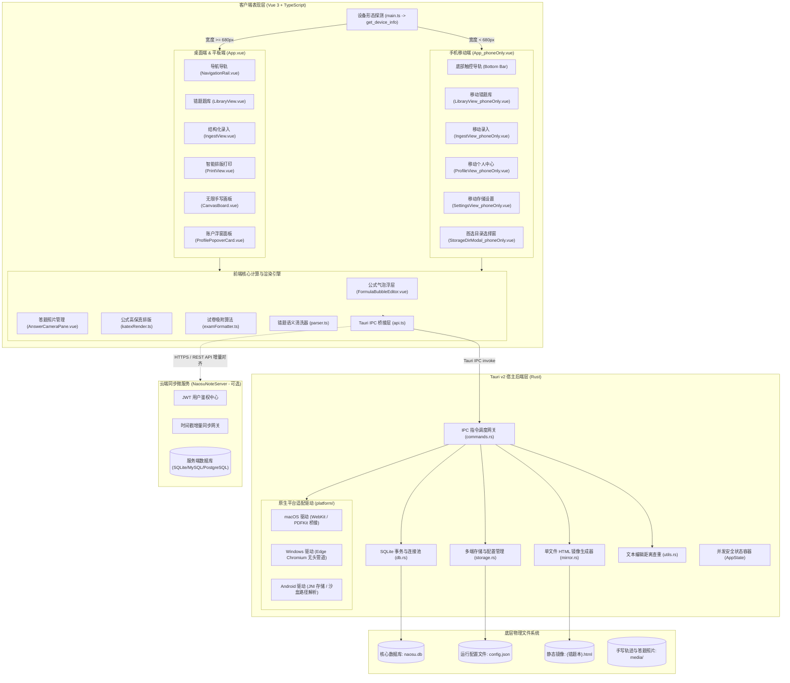

# NaosuNote 架构设计与系统技术手册 (Architecture & Technical Manual)

> **版本**：beta0.2.2  
> **核心架构**：Tauri v2 + Vue 3 (Composition API) + TypeScript + Rust + SQLite (rusqlite) + KaTeX + Material Design 3  
> **支持终端**：macOS (Apple Silicon & Intel x64), Windows (x64 & ARM64), Android (Universal APK & Per-ABI APK), iOS / Web 浏览器预览  
> **适用对象**：系统维护者、跨端开发团队及学术研发人员

---

## 目录

1. [项目定位与核心设计哲学](#一-项目定位与核心设计哲学)
2. [跨端系统整体拓扑与分层架构](#二-跨端系统整体拓扑与分层架构)
3. [源码目录导航与职责矩阵](#三-源码目录导航与职责矩阵)
4. [核心子系统与关键技术实现](#四-核心子系统与关键技术实现)
   - [4.1 多形态设备自适应渲染架构 (Dual-Layout Architecture)](#41-多形态设备自适应渲染架构-dual-layout-architecture)
   - [4.2 零预设本地优先与多端自适应存储引擎 (Storage & Persistence Engine)](#42-零预设本地优先与多端自适应存储引擎-storage--persistence-engine)
   - [4.3 智能一页吸附与试卷排版引擎 (Auto-Fit Typesetting Engine)](#43-智能一页吸附与试卷排版引擎-auto-fit-typesetting-engine)
   - [4.4 矢量手写画板与公式气泡编辑系统 (Canvas & Formula Bubble Editor)](#44-矢量手写画板与公式气泡编辑系统-canvas--formula-bubble-editor)
   - [4.5 双轨持久化与离线 HTML 单文件镜像器 (Mirroring Engine)](#45-双轨持久化与离线-html-单文件镜像器-mirroring-engine)
   - [4.6 云端双向同步协议与离线增量合并 (Cloud Sync Protocol)](#46-云端双向同步协议与离线增量合并-cloud-sync-protocol)
   - [4.7 原生高保真矢量 PDF 输出与静默打印架构](#47-原生高保真矢量-pdf-输出与静默打印架构)
5. [跨端工程打包与流水线规范](#五-跨端工程打包与流水线规范)
6. [设计规范与避坑准则 (Coding Standards & Crucial Caveats)](#六-设计规范与避坑准则-coding-standards--crucial-caveats)

---

## 一、 项目定位与核心设计哲学

NaosuNote 是专为 **STEM（科学、技术、工程、数学，涵盖数学、物理、化学、生物）** 理科学科深度定制的专业级错题管理、画板推演与试卷智能重练排版系统。

### 核心设计原则

1. **本地优先与去中心化自由 (Local-First & Absolute Data Sovereignty)**：
   - 用户完全拥有自己的数据资产。系统初次启动默认进入纯本地离线模式，无需注册或强制登录。
   - 用户名与头像采用中立设计，允许用户自由自定义本地昵称与头像图片，彻底杜绝任何硬编码的预设私人信息。
   - 存储路径自适应设备特性：在桌面端默认存储于系统文档目录；在 Android/iOS 移动端支持用户根据设备环境选择专属沙盒、外部公开文档目录或自定义目录，并在设置面板中随时迁移。
2. **多端形态自适应交互 (Adaptive Form Factors)**：
   - 针对桌面宽屏与平板大屏，提供带有左侧导航导轨、双栏联动的空间利用布局；
   - 针对移动手机竖屏，提供独立的单手导航底栏、轻量化抽屉弹窗与大触控热区的移动专用交互流；
   - 启动期由 Rust 底层 `get_device_info` 原生探测屏幕尺寸与系统特性，无缝直推最适配的界面形态。
3. **学术级严谨规范与零格式污染**：
   - 界面文字与题干排版彻底剔除 Emoji 表情包及非正式日文假名，保持学术考核与考试试卷的严谨度。
   - 公式由本地 KaTeX 引擎执行严格 LaTeX 语法解析与离线渲染，杜绝网络公式服务抖动。
   - 包含电路图、有机反应机理图、受力分析图与遗传系谱图等，均采用内嵌 SVG 矢量图渲染，任意缩放无锯齿。
4. **智能一页吸附排版 (Auto-Fit Algorithm)**：
   - 破解长题目跨页切断的行业顽疾：将长选择题选项智能整列（1列/2列/4列自适应），将表格与图例自动重排为图文左右并排（Side-by-Side），实现高紧凑度与 A4/B5 单页黄金吸附。
5. **双轨数据保护机制**：
   - 核心关系型数据落盘至 SQLite (`naosu.db`)；
   - 镜像管道自动将每个错题本同步输出为独立的单文件离线 HTML。即便软件脱离运行环境，直接使用任意系统自带浏览器双击即可完整阅读与打印错题集。

---

## 二、 跨端系统整体拓扑与分层架构



---

## 三、 源码目录导航与职责矩阵

```text
NaosuNote/
├── src/                                  # 前端源码 (Vue 3 + TypeScript)
│   ├── main.ts                           # 前端主入口：设备形态识别、组件挂载、系统级快捷键
│   ├── App.vue                           # 桌面与平板端主容器 (大屏侧边导轨 + 宽屏视图联动)
│   ├── App_phoneOnly.vue                 # 移动端专用主容器 (底部触控栏 + 抽屉弹窗 + 竖屏自适应)
│   ├── components/                       # 通用 UI 组件
│   │   ├── NavigationRail.vue            # 桌面导航导轨 (展开/收起、当前学科快捷筛选、主题切换)
│   │   ├── ProfilePopoverCard.vue        # 桌面端个人中心浮动弹层 (自定义头像、同步状态展示)
│   │   ├── StorageDirModal_phoneOnly.vue # 移动端存储目录配置模态窗 (内置各系统默认预设与自定义输入)
│   │   ├── canvas/                       # 手写板与公式编辑子组件
│   │   │   ├── CanvasBoard.vue           # 矢量手写板 (笔触压感、无限画布漫游、撤销重做)
│   │   │   └── FormulaBubbleEditor.vue   # 悬浮公式气泡输入窗 (KaTeX 实时公式拾取与插入)
│   │   └── answer/
│   │       └── AnswerCameraPane.vue      # 答题卡与照片录入面板 (拍照、相册导入、Markdown 查看)
│   ├── views/                            # 业务视图层
│   │   ├── LibraryView.vue               # 桌面错题库 (树状学科导航、多维标签筛选、批量移动/导出)
│   │   ├── LibraryView_phoneOnly.vue     # 移动错题库 (卡片滑动、竖向紧凑流、触控上下文菜单)
│   │   ├── IngestView.vue                # 桌面录入界面 (结构化 HTML 输入、智能实时查重比对)
│   │   ├── IngestView_phoneOnly.vue      # 移动录入界面 (折叠面板、移动端查重浮窗)
│   │   ├── PrintView.vue                 # 智能排版视图 (试卷双栏预览、单页吸附计算、无损打印调起)
│   │   ├── ProfileView_phoneOnly.vue     # 移动个人中心 (本地用户信息管理、云端同步配置)
│   │   └── SettingsView_phoneOnly.vue    # 移动设置中心 (存储目录切换、题库重置与镜像导出)
│   ├── utils/                            # 前端核心工具库
│   │   ├── api.ts                        # Tauri IPC 与云端 REST API 统一封装门面
│   │   ├── avatar.ts                     # 默认中立矢量头像与头像持久化管理
│   │   ├── examFormatter.ts              # 试卷智能排版算法 (图文并排、选项对齐、一页吸附计算)
│   │   ├── katexRender.ts                # KaTeX 本地公式安全渲染流水线
│   │   ├── parser.ts                     # 标准错题 HTML 语义解析与内容清洗
│   │   └── theme.ts                      # Material Design 3 全局色彩 Token 与主题切换引擎
│   └── types/                            # 跨层 TypeScript 类型定义
│       └── problem.ts                    # 错题、题库、设备信息、同步模型契约接口
│
├── src-tauri/                            # 后端源码 (Rust 核心)
│   ├── Cargo.toml                        # Rust 依赖声明 (tauri, rusqlite, serde, dirs, image 等)
│   ├── tauri.conf.json                   # Tauri 跨平台窗口、权限与打包规格配置
│   ├── src/
│   │   ├── main.rs                       # 后端二进制入口
│   │   ├── lib.rs                        # Tauri 应用初始化编排、插件注册与 IPC 路由表挂载
│   │   ├── commands.rs                   # 核心 IPC 指令处理分发层 (全平台统一接口)
│   │   ├── db.rs                         # SQLite 数据库底层操作抽象层 (自动建表、增删改查)
│   │   ├── storage.rs                    # 存储引擎与多端路径自适应解析器 (config.json 管理)
│   │   ├── mirror.rs                     # 离线单文件 HTML 镜像生成与同步引擎
│   │   ├── models.rs                     # Rust 数据实体结构 (Problem, Notebook, DeviceInfo 等)
│   │   ├── utils.rs                      # Levenshtein 编辑距离算法实现与单元测试
│   │   └── platform/                     # 跨操作系统底层能力接入
│   │       ├── mod.rs                    # 跨平台打印与环境统一门面
│   │       ├── macos.rs                  # macOS 专有无头 PDFKit 管道实现
│   │       └── windows.rs                # Windows Edge Chromium 静默打印调用管道
│   └── gen/                              # 移动端跨平台构建工程 (Android Gradle / iOS Xcode)
│       └── android/                      # Android 原生包装工程 (Gradle 脚本、清单与本地属性)
│
├── platforms/                            # 平台特定资源与一键打包流水线
│   ├── android/scripts/
│   │   └── package-apk.sh                # Android APK 自动化构建脚本 (支持全架构通用包与切分包)
│   ├── macos/
│   │   ├── bin/html2pdf                  # 预编译 macOS 高性能 PDF 生成工具
│   │   ├── native/html2pdf.m             # 原生 Objective-C WebKit 渲染器源码
│   │   └── scripts/package-app.sh        # macOS 一键 DMG / APP 构建脚本
│   └── windows/scripts/
│       ├── package-portable.ps1          # Windows 单文件 EXE / 绿色 Zip 打包脚本 (PowerShell)
│       └── package-portable.bat          # Windows 双击快速打包入口批处理
│
├── NaosuNoteServer/                      # 云端增量同步后端 (Go Gin 架构，可选独立部署)
└── release-portable/                     # 跨平台构建发布产物归集目录 (已配置 Git 忽略)
```

---

## 四、 核心子系统与关键技术实现

### 4.1 多形态设备自适应渲染架构 (Dual-Layout Architecture)

为同时兼顾 PC 桌面端（键鼠多窗口、大屏）、平板（触控笔手写、双栏分屏）以及智能手机（单手触控、竖屏流式）的差异化操作体验，NaosuNote 采用形态解耦架构：

1. **设备探测管道**：
   在应用挂载时，`main.ts` 首先调用 Rust 后端指令 `get_device_info`：
   ```rust
   // src-tauri/src/commands.rs
   #[tauri::command]
   pub fn get_device_info(window: tauri::Window) -> Result<crate::models::DeviceInfo, String> {
       #[cfg(any(target_os = "windows", target_os = "macos", target_os = "linux"))]
       {
           let _ = window;
           Ok(crate::models::DeviceInfo {
               platform: "desktop".into(),
               form_factor: "desktop".into(),
               os: std::env::consts::OS.into(),
               screen_width_dp: 1200.0,
           })
       }
       #[cfg(any(target_os = "android", target_os = "ios"))]
       {
           let _ = window;
           let os_str = if cfg!(target_os = "ios") { "ios" } else { "android" };
           Ok(crate::models::DeviceInfo {
               platform: "mobile".into(),
               form_factor: "phone".into(),
               os: os_str.into(),
               screen_width_dp: 390.0,
           })
       }
   }
   ```
2. **动态形态装载**：
   `main.ts` 根据返回的 `form_factor` 与窗口实际像素宽度：
   - 宽度 `< 680px` 或移动平台判定为 Phone 时，动态挂载 `App_phoneOnly.vue`；
   - 其余情况挂载完整版 `App.vue`。

---

### 4.2 零预设本地优先与多端自适应存储引擎 (Storage & Persistence Engine)

为确保绝对数据主权与极简初始体验，系统实施以下设计：

1. **初始零预设状态**：
   - 首次安装启动，本地认证状态统一初始化为未登录 (`naosu_is_logged_in = false`)；
   - 默认头像采用矢量纯色 Material 图标 (`DEFAULT_AVATAR_SVG`)，不绑定任何特定测试邮箱或假名昵称；
   - 用户在本地模式下可随意修改昵称与本地头像，无需经过云端中转。
2. **多端自适应持久化路径解析**：
   各操作系统对于文件写入权限有严格安全限制（如 Android 10+ 分区存储 Scoped Storage、iOS 专属沙盒）。系统通过 `get_storage_options` 提供系统级预设选项：
   - **Android**：
     - 预设 A（沙盒内部存储）：`/data/user/0/com.naosunote.app/files/NaosuNoteData`，安全性最高；
     - 预设 B（共享文档目录）：`/storage/emulated/0/Documents/NaosuNoteData`，便于用户导出备份；
     - 自定义输入：支持自由指定特定外部 SD 卡或目录。
   - **iOS**：
     - 预设 A（应用文档目录）：`~/Documents/NaosuNoteData`，支持 iTunes / 文件 App 访问；
     - 预设 B（支持库目录）：`~/Library/Application Support/NaosuNoteData`。
   - **Windows / macOS / Linux**：
     - 默认：`~/Documents/NaosuNoteData/`。
3. **配置持久化与热重载**：
   所选存储根路径持久化保存在用户应用配置目录下的 `config.json`：
   ```json
   {
     "data_dir": "/Users/yunoi/Documents/NaosuNoteData"
   }
   ```
   当用户在前端通过 `StorageDirModal_phoneOnly.vue` 或设置面板切换目录时，Rust 后端 `set_data_dir` 自动重新初始化 SQLite 数据库连接池并平滑迁移既有种子数据。

---

### 4.3 智能一页吸附与试卷排版引擎 (Auto-Fit Typesetting Engine)

在导出或打印理科试卷时，公式、表格与长图极易导致大题在页面中部断开，破坏作答完整性。NaosuNote 在 `src/utils/examFormatter.ts` 中构建了自适应排版引擎：

1. **图文左右并排 (Side-by-Side Processing)**：
   - 自动检测题干中的三线表（`<table>`）与矢量配图（`<svg>` 或 ``）；
   - 满足并排阈值时，自动将原本上下堆叠的结构包装为 Flex 布局的左右分栏网格，表格居左、图例居右，横向对齐率达 100%，垂直页面占用缩减 40% 以上。
2. **长选项自适应网格对齐 (Choice Options Adaptive Columnization)**：
   - 分析四项选择题（A/B/C/D）字符长度：
     - 所有选项极短（平均长度 < 12 字符）：自动排成 **4 列横排**（占单行）；
     - 选项中等长度（平均长度 13~28 字符）：自动排成 **2 列双行**；
     - 选项包含复杂长公式或大篇幅描述：保持 **1 列 4 行** 纵向排列。
3. **一页吸附密度压缩**：
   - 计算单题整体高度，在打印样式中注入 `@media print { page-break-inside: avoid; }`；
   - 提供紧凑试卷模式（缩减行间距与外边距 25%），最大化促成综合题在单页内完整呈现。

---

### 4.4 矢量手写画板与公式气泡编辑系统 (Canvas & Formula Bubble Editor)

在推导理科题目或订正反思时，纯文本输入往往无法满足草稿演算需求。

1. **无限手写演算板 (`CanvasBoard.vue`)**：
   - 基于 HTML5 Canvas 搭配离屏渲染技术构建；
   - 具备压感模拟、笔迹平滑平滑化贝塞尔曲线拟合算法；
   - 支持多层绘制（草稿铅笔、荧光记号笔、橡皮擦）、手势双指平移与等比缩放；
   - 具备完整的基于堆栈的撤销（Undo）与重做（Redo）操作流；
   - 笔迹可直接无损保存为 WebP/PNG 附件，关联至当前错题的订正流中。
2. **公式气泡悬浮编辑器 (`FormulaBubbleEditor.vue`)**：
   - 用户在题干编辑区域键入或划选公式时触发；
   - 内置理科常用 LaTeX 符号快捷矩阵（包含希腊字母 $\alpha, \beta, \gamma, \Delta$、微积分算子 $\int, \lim, \frac{dy}{dx}$、化学方程式配平上下标、矩阵等）；
   - 集成实时 KaTeX 双向视图：用户键入 LaTeX 源码的同时，上方气泡毫秒级渲染出最终排版效果，确认后一键插入光标处。

---

### 4.5 双轨持久化与离线 HTML 单文件镜像器 (Mirroring Engine)

为防止客户端升级、配置漂移或极端系统故障导致题库数据遗失，系统构建了全自动单文件镜像机制：

1. **触发机制**：
   每当新增、修改、批量移动错题或完成云端同步后，Rust 后端 `sync_all_mirrors` 自动在后台异步启动。
2. **单文件自包含特性**：
   - 生成的 HTML 文件包含完整的错题元数据、分类、KaTeX 内联样式与渲染后的 DOM；
   - 本地题图与手写草稿自动通过 `mirror.rs` 内置的 `base64_encode` 算法转为 Data URL 嵌入 HTML；
   - 用户可脱离 NaosuNote 应用，随时将 `.html` 文件拷入手机、U 盘或发送至打印店，使用任意现代浏览器均能保持 100% 原始视觉效果。

---

### 4.6 云端双向同步协议与离线增量合并 (Cloud Sync Protocol)

为支持多设备数据互通（例如手机拍照录题，平板使用画板演算，PC 整理导出试卷），系统提供与 `NaosuNoteServer` 对接的轻量 RESTful 增量同步流：

```text
客户端                                             云端服务器
  │                                                   │
  ├────── POST /api/v1/auth/login (JWT 鉴权) ─────────>│
  │<───── 返回 access_token 与用户信息 ────────────────┤
  │                                                   │
  │─── POST /api/v1/sync/push (带 last_sync_timestamp)─>│
  │    提交本地新增/修改的错题与分类增量                   │
  │<── 返回云端变更集合与最新全局 server_timestamp ─────┤
  │                                                   │
  │─── POST /api/v1/sync/upload-image (上传图片资源) ───>│
  │<── 返回持久化远程 URL                              │
  │                                                   │
  └─── 触发本地 mirror.rs 重新渲染各科 HTML 镜像 ───────┘
```

- **冲突裁决准则**：在本地离线修改与云端更新发生时间碰撞时，以 `updated_at` 时间戳为基准采用“最新写入胜出（Last-Write-Wins）”策略，确保各端状态收敛一致。

---

### 4.7 原生高保真矢量 PDF 输出与静默打印架构

NaosuNote 彻底放弃了质量低劣的网页截图式 Canvas 打印方案，针对主流桌面操作系统实现平台级原生管道：

1. **macOS 架构**：
   - 后端通过 `platforms/macos/bin/html2pdf` 调用由 Objective-C 编写的原生命令行工具 (`html2pdf.m`)；
   - 底层使用 WebKit 的 `WKWebView` 加载格式化后的静态 HTML 试卷，并通过 `NSPrintOperation` 与 PDFKit 将矢量 DOM 直接合成至物理 PDF 文件，公式文字无损保真、支持光标选中复制。
2. **Windows 架构**：
   - 后端调用系统现成的 Microsoft Edge Chromium 引擎无头进程：
     `msedge.exe --headless --disable-gpu --run-all-compositor-stages-before-draw --print-to-pdf="out.pdf" "temp.html"`
   - 零额外环境依赖，100% 还原排版，无需用户安装任何虚拟打印机驱动。

---

## 五、 跨端工程打包与流水线规范

工程所有平台的打包流水线均严格归集至统一的根目录产物文件夹：`release-portable/`。

### 5.1 自动化打包指令速查

| 目标平台 | 打包指令 | 底层脚本路径 | 输出目标产物 |
| :--- | :--- | :--- | :--- |
| **Android** | `npm run package:android` 或 `pnpm run package:android` | `platforms/android/scripts/package-apk.sh` | `release-portable/NaosuNote_0.2.2_app-universal-release-unsigned.apk` |
| **macOS** | `npm run package:macos` 或 `pnpm run package:macos` | `platforms/macos/scripts/package-app.sh` | `release-portable/NaosuNote_0.2.2.dmg` 与 `NaosuNote.app` |
| **Windows** | `npm run package:windows` 或 `pnpm run package:windows` | `platforms/windows/scripts/package-portable.ps1` | `release-portable/NaosuNote_0.2.2_x64.exe` 与免安装 Zip |

### 5.2 Android 打包高级参数支持

`package-apk.sh` 支持透传自定义编译参数：
```bash
# 构建全架构通用 Release APK (默认)
bash platforms/android/scripts/package-apk.sh

# 构建 Debug 调试 APK
bash platforms/android/scripts/package-apk.sh --debug

# 针对指定芯片架构构建 (例如 ARM64)
bash platforms/android/scripts/package-apk.sh --target aarch64

# 按 ABI 分割构建独立轻量 APK
bash platforms/android/scripts/package-apk.sh --split-per-abi
```

---

## 六、 设计规范与避坑准则 (Coding Standards & Crucial Caveats)

1. **禁止假名与 Emoji 污染**：
   - 代码内注记、日志输出、UI 提示文本、生成的 HTML 镜像与示例数据中，**严禁添加 Emoji 图标与非规范假名**，严格保持理科试卷与生产级软件的学术风格。
2. **避免非必要的动态 Import**：
   - 跨模块静态依赖（例如 `@tauri-apps/api/core`、`src/utils/avatar.ts` 等）应当在文件头部集中进行静态 import，避免在业务函数内使用 `import(...)` 导致 Vite 产生重复 Chunk 警告与首帧微卡顿。
3. **Tauri IPC Command 声明规范**：
   - Rust 端接受前端参数较多的 Command 时，须明确声明 `#[allow(clippy::too_many_arguments)]`，同时使用 `Option<T>` 妥善兼容前端可能省略传参的字段。
4. **数据库连接生命周期控制**：
   - `rusqlite` 连接必须由 `AppState` 的 `Mutex<DbManager>` 严格控制生命周期，在操作完成后立即释放锁，杜绝在跨 await 异步上下文中持有 MutexGuard 导致线程死锁。
5. **路径跨端兼容性规范**：
   - 在 Rust 后端拼接本地持久化路径时，严禁使用硬编码的斜杠或反斜杠，一律使用 `std::path::PathBuf::push`。
